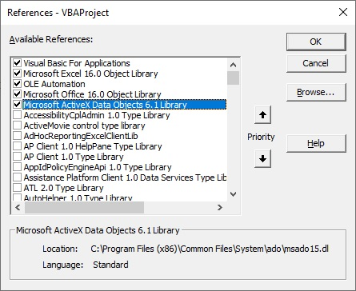

# Описание программы Firebird_Excel_Connector

Программа `Firebird_Excel_Connector` предназначена для выполнения SQL-запроса к базе данных Firebird и размещения результатов на новом листе в книге Excel.

## Как использовать

1. Откройте книгу Excel Firebird_Connection.xlsm.
2. На листе `Options` в столбце `B` укажите параметры подключения к базе данных:
   - Хост сервера (`Server`), на котором работает Firebird. Ip-адрес сервера (или localhost если firebird есть у вас дома).
   - Имя базы данных (`Database`). Название базы данных в формате *.fdb.
   - Имя пользователя (`Login`). 
   - Пароль (`Password`).
3. На листе `Request` введите SQL-запрос в ячейку A1.
4. На листе `Request` нажмите кнопку `Выполнить запрос`
Результаты запроса размещаются на новом листе с именем "yyyy-mm-dd_hh-nn-ss" (текущая дата и время).

## Требования

- Microsoft Excel
- Доступ к базе данных Firebird
- Драйвер ODBC для Firebird (скачивается с официального сайта https://firebirdsql.org/en/odbc-driver/

ссылка на последнюю актуальную версию
https://sourceforge.net/projects/firebird/files/firebird-ODBC-driver/2.0.5-Release/Firebird_ODBC_2.0.5.156_x64.exe/download)
- Добавить ссылку на библиотеку Microsoft ActiveX Data Objects 6.1 Library. 

